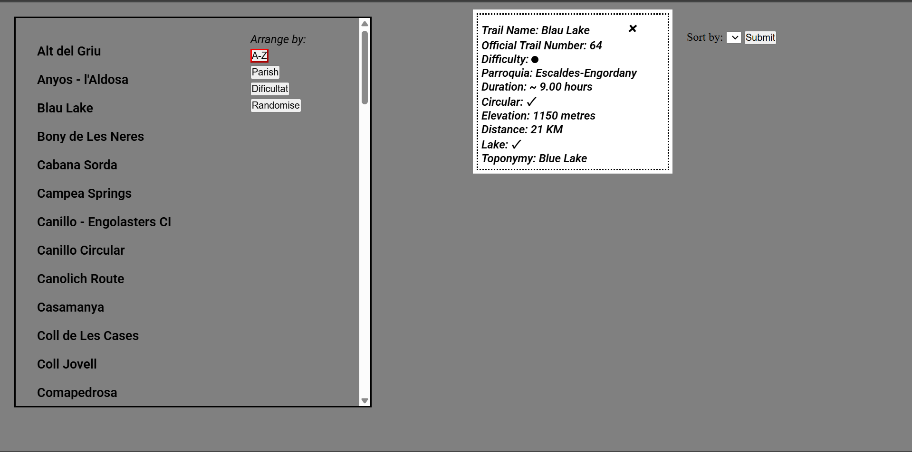
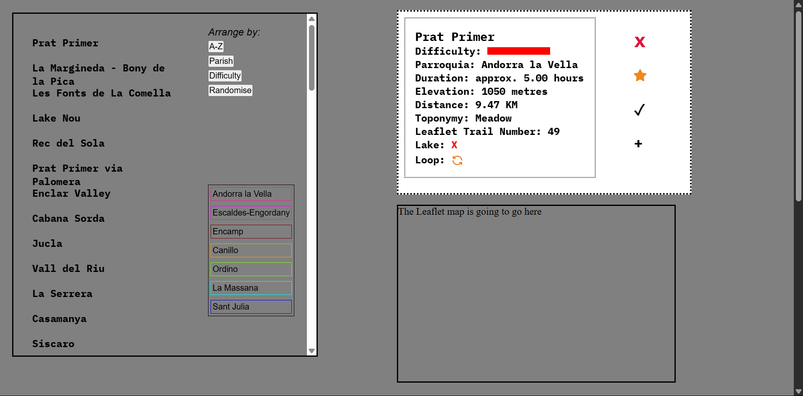
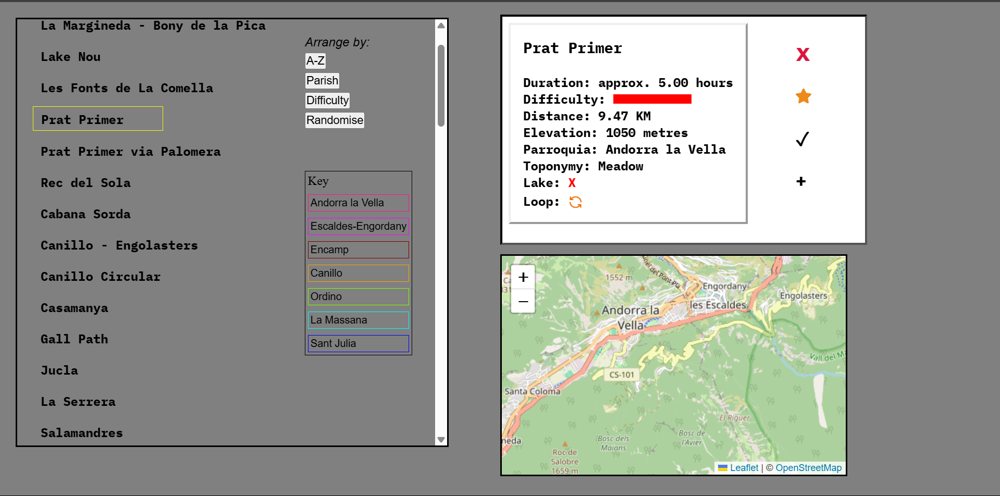
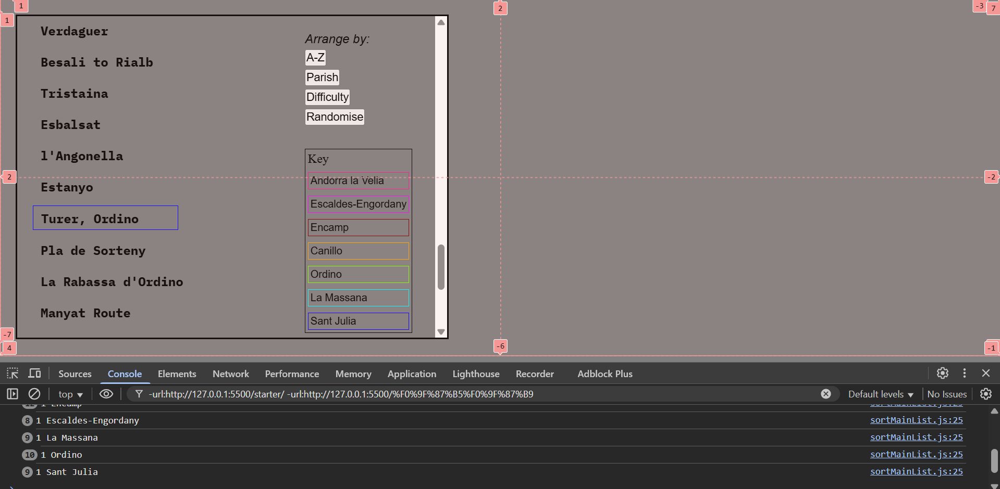
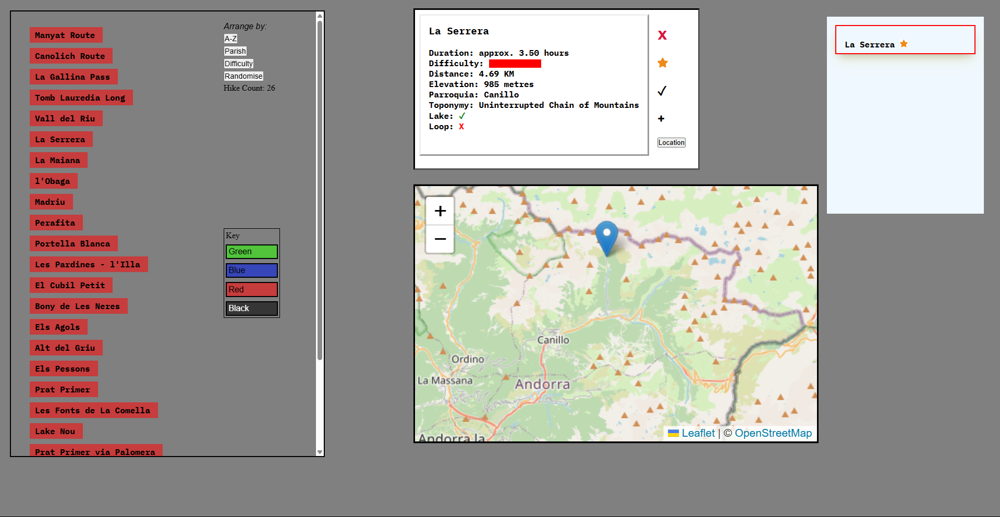
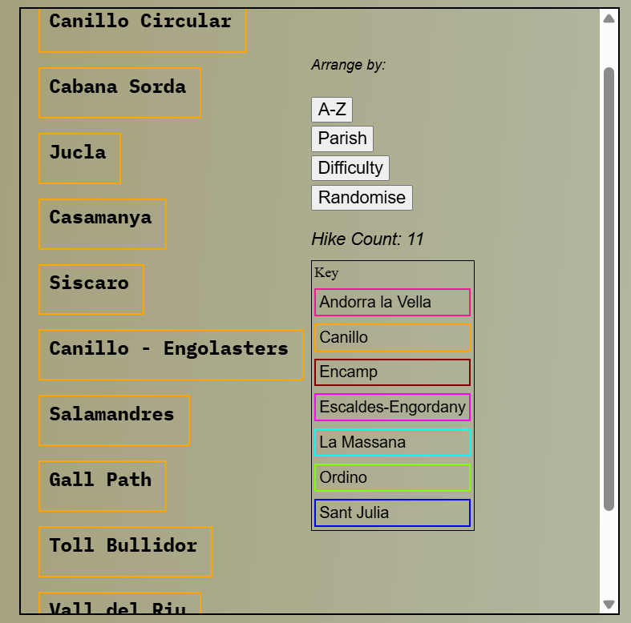
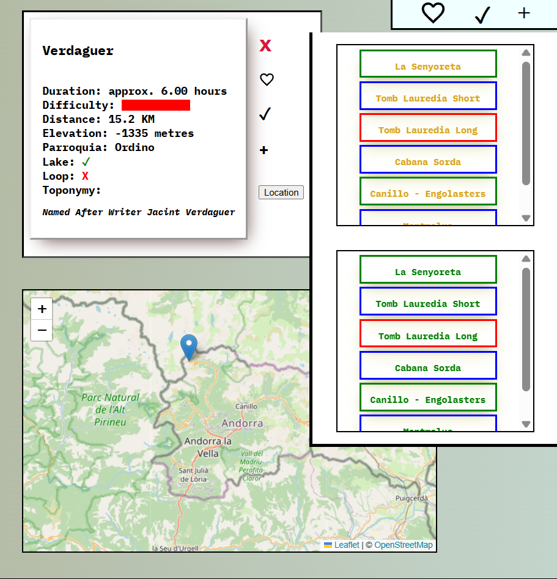
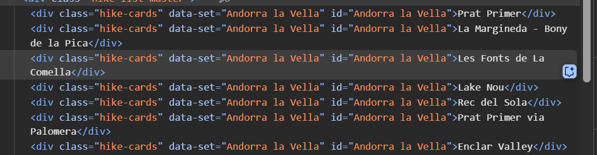
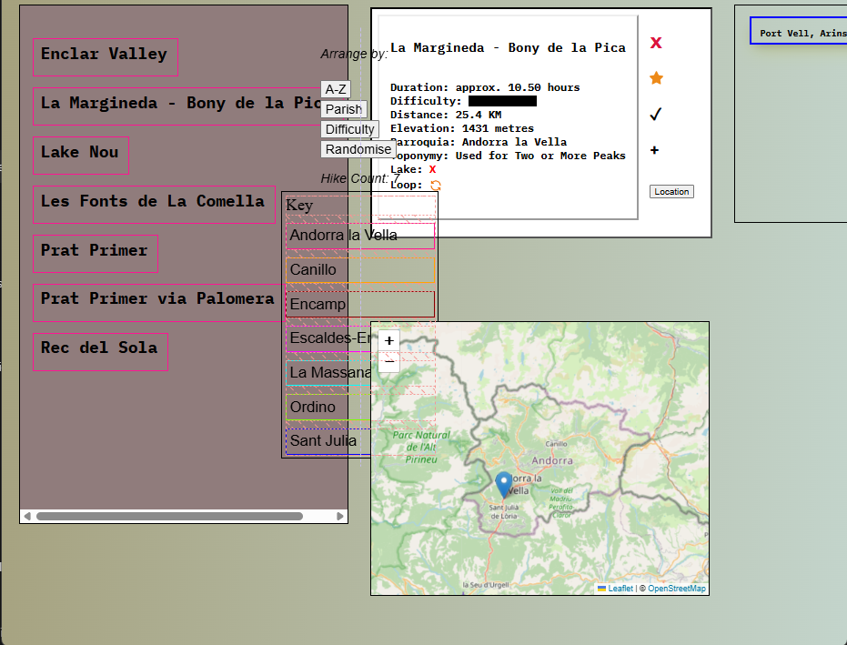

# Andorra Hikes with API - re-development: 5th May 2025

> [!NOTE]
> The original project was made in around a week: from 11th March to 19th March 2025. See Screenshot One.

This was one of the first ideas that I had when I started out on my own as it's something that I do a lot in my free time so I knew that I would be much more motivated to develop the idea instead of doing something generic as part of a course, as I had been doing.

Upon completing the original app, I came across another idea for various English language apps (see my Reported Speech and Gerunds and Infinitives Dominoes apps) and those took me right up to the end of April. The plan is now to do a review of this project both to see how it has aged in line with my abilities and also to add a the Leaflet API.

> [!CAUTION]
> Below are the notes from the original project which I will leave here for my own perusal

### User Story Original

- These are all of the hikes in Andorra. I have them as individual physical leaflets but it would be good to search for them by difficulty and area.
- At the moment you just search by number.
- Time, distance and elevation gain and loss needs to be added for more interactivity.
- The final goal is to get the requested data using Promises in JS.
- For example, I want to do a hike in Encamp and I want something under two hours but difficult ('blue' or 'red').
- There will also be a selection for 'circular' or not, meaning that the trail is based on a loop that ends where it started and not by using the same trail to descend.

### To improve original - 11th March 2025

- capability to save hikes to favourites and toggle done etc.; add to to-do
- figure out the best way to get the hikes from local JSON file - DONE
- utilise innerHTML more - DONE using object destructuring
- use ID from the beginning. The hikes do actually come with a number...
- SORT function - DONE
- images are not really of concern here but maybe a carousel would be good
- clean HTML design with nice clear transitions and search fields - opted against search fields
- randomise button - DONE

# Version Two

### Improvements

I would really like to host the data somewhere as if it were a real API. By far the most labour-intensive task here was inputting the data from the physical leaflets to the JSON file. There was no other obvious way to do this as it isn't in as much detail online - one of the driving factors of the project.

These are the aspects that I'm going to focus on for v2:

- removing anything that is not required: Sort by option - DONE
- add map using Leaflet - DONE
- (possibly with current location request)
- add color guidance or borders to activate once the hikes have been sorted by parish and difficulty - DONE
- add animation to the 'key' - clickme bounce - DONE with parish and difficulty options
- add counter
- add functionality to check-in to refuge - not sure about this one
- digital passport which would digitize the currently available one
- add to favourites - DONE.. functionality?
- a suggestion was to have a short video of each showing what they are really like
- ADD HUTS and rating
- Route maps?? hard work

### Screenshots

1. Showing the original project that was made in around a week. I was very happy with the result despite its basic appearance. The addition of the Leaflet API should fit nicely into the available space.



2. After a couple of hours work there is a change in design and I've added user options to the right of the hike information card: favourite, completed and to-do. I'm going to have these as fully functional and save the events in a menu area or pop-up window.


3. This was the first task that I got stuck on. I was trying to figure out how to organise the hikes into various colour-coded groups AFTER clicking the 'Parish' sort option. As outlined above, I wasn't sure whether to have them individually coloured or in large blocks, by parish:



4. I got stuck for a couple of hours trying to figure out how Leaflet works as I have not utilised it since using it as part of a course last year. I went straight ahead and put it into its own module but it was not displaying after troubleshooting everything including Webpack configuration to the import CSS line of code. What I have to do next is connect the individual hike info to the Leaflet coordinates:



5. This screenshot shows the same issue as outlined in Screenshot Three with some progress made. See Difficulties Three below:



6. The below screenshot shows the following progress being made: grid layout and calculations amended; colours added to hike list depending on filter; map transforms on hover; favourites logic and container added to column; counter added; small Keyframes animation added (not seen in screenshot):



7. After trying multiple different calculations and variants, I decided that it would be worth re-formatting the layout with Flex. You can see that the right-hand column of the grid is encroaching on the left-hand space when given chance. Using Flex with space-between or something would resolve it:

 /_ I think this is the correct screenshot _/

8. Showing some more progress as I come to the end of this Version of the app. We have the favourites, completed, and to-do options floating in the top-right corner: toggle mode activates the correct div on click and gets the data. I've also added a nice notifications pop-up to the bottom-left corner which notifies on adding to favourites, completed and to-do; and also checks that it doesn't already exist within these categories. A warning pops up if so.



### Difficulties

1. The first main issue I had with version two was the dragging element of Leaflet becoming inactive after clicking on a second hike from the list. From what I read online, this is a common issue with Leaflet as the Map element must be empty when another event is fired to re-initialise the map - which is exactly what I was trying to do.

- _RESOLVED_ using:

```
 document.querySelector(".hike-card-container").innerHTML = "";

      if (map) {
        map.remove();
      }
```

Although the solution is simple, it took many different orders, modules and variations to get it correct owing to Leaflet being quite fussy.

2. The next one wasn't so much problematic as long-winded as I had to find the coordinates for 50+ hikes. I used ChatGPT to see if it could handle the request but it repeatedly returned ten or so hikes with questionable coordinates. It has to be done manually for peace of mind >> it's taken around one day to correct.

3. This task relates to Screenshots Three and Five. The borders were responding to the logic - changing their colour to the key on the right based on Difficulty - but the `switch` statement was only picking up the final result, as seen in the console. It is something to do with the final condition in the switch statement and the final result in the console so I will continue working on it until it's sorted.

- _RESOLVED_ by adding a class dynamically on creation - a new move for me

4. I had to dedicate a fair amount of time in trying to figure out a way to get the filtered parish options first to display in the hike list master container and then to get the colours to apply using the existing IDs. The main issue is the format: #Andorra-la-Vella - capitalised and hyphenated:



- _RESOLVED_ by grafting the `target` variable onto the `replace()` method:

```
toArrayHikes.forEach((hike) => {
        if (hike.dataset.set === target) {
          console.log(hike);
          newArray = arrayOfAll.filter((hikeObj) => hikeObj.area === target);
          console.log(newArray);
        }
        hikeListMaster.innerHTML = "";
        const hyphenatedTarget = target.replace(/\s+/g, "-");

        for (const hike of newArray) {
          hikeListMaster.innerHTML += `<div class="hike-cards" data-set="${hike.area}" id="${hyphenatedTarget}">${hike.trail}</div>`;
        }
})
```

5. After connecting my laptop to the larger screen on my desktop set-up, the dreaded issue of scalability and responsive design, which I hadn't accounted for, cropped up so I had to dedicate some hours to re-modelling the structre of the body and the containers. I found that the REM didn't always work as expected, nor did VW. On the other hand, VH seemed to scale things up and down quite well when used alongside REM.

_RESOLUTIONS_

- moving away from PX and using REM where possible
- re-instating the factory margin reset etc.
- had a dabble with media queries which I hadn't used before
- using percentages. Remember to try `FLEX: 1, FLEX: 3` next time
- to start small with the next project and scale up, not down
- started looking into React

6. Container elements pushing outside or not downsizing on screen minimise:



I have tried a few different things here including changing the box to Flex. In the end, after playing with media queries etc., the resolution was to clamp the left container to a minimum screen width. That seemed to be the best way to fix it for the time being without having to do a full revision of the layout.

> [!NOTE]
> Next time I'll be focusing on making the app's layout responsive from the outset => mobile orientation
